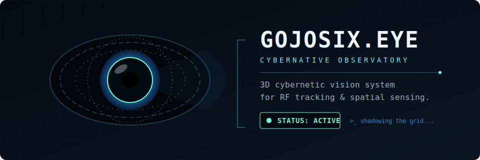

# gojosix.eye net

<p align="center">
  
</p>

<div align="center">

[](https://www.rust-lang.org)
[](https://ziglang.org)
[](https://github.com/emilk/egui)
[](https://www.kernel.org)
[](#open-source-licensing)
[](#gojosixeye-net)

> **Initializing DecentralRadar v1.0...** <br>
> *STATUS*: Illuminating the invisible. 🎃 <br>
> *LAYER*: Shadowing the grid. 🥷 <br>
> *RESULT*: Maximum signal. 💥 

</div>

```text
                  ┌──────────────────────────────────────────────────────────┐
                  │SYSTEM::NODE_SCAN   [▓▓▓▓▓▓▓▓░░] 80%   (🛰️)  LOC: PRIVATE │
                  ├──────────────────────────────────────────────────────────┤
                  │                                                          │
                  │          ◢◤                        ◥◣                    │
                  │        ◢◤     ▄▄▄▄▄▄▄▄▄▄▄▄▄▄▄▄▄     ◥◣                   │
                  │       █      █                 █      █                  │
                  │       █      █     ◢█████◣     █      █    TRK: 5.0 GHz  │
                  │       █      █    █   ◉   █    █      █    SIG: STABLE   │
                  │       █      █     ◥█████◤     █      █    BUF: CLEAR    │
                  │       █      █_________________█      █                  │
                  │        ◥◣                            ◢◤                  │
                  │          ◥◣       GOJOSIX.EYE      ◢◤                    │
                  │            ◥◣____________________◢◤                      │
                  │                                                          │
                  ├──────────────────────────────────────────────────────────┤
                  │[!] Illuminating the invisible. | [!] Shadowing the grid. │
                  └──────────────────────────────────────────────────────────┘
```

`gojosix.eye net` is the identity and presentation layer for this repository's desktop app. 
The Cargo package name is `decentral-radar`, but the app itself is presented as a highly stylized **signal observatory**.

<p align="center">
  
</p>

---

## 📡 What is this project?

This project is a **Linux desktop application** that scans nearby WiFi networks and transforms them into a live, radar-like observatory. 

It synthesizes:
* 🦀 **Rust** for the UI, state modeling, multi-threading, and spatial heuristics.
* ⚡ **Zig** for high-performance, low-level `nl80211` WiFi scanning through a dynamically linked shared library.
* 🎨 **egui/eframe** for the buttery-smooth, animated dashboard and radar panel.
* 🐧 **Linux Utils** (`nmcli` and `ip neigh`) for network context and LAN-neighbor visibility.

The result is a **local-first** tool for visualizing RF visibility in your physical space, unlocking:
- 📍 Nearby SSIDs & BSSIDs tracking
- 📊 Signal strength (RSSI) historical graphing
- 🚦 Spatially-aware channel congestion mapping
- 🏷️ Vendor/OUI hints for unknown signals
- 🕵️ Connected-device awareness & role hints
- 🚶 RSSI-based presence and motion heuristics
- 🏠 Room fingerprinting and health summaries

## 👁️ Why it was created (and why it's unique)

Most WiFi tools fall into two extremes: purely technical, text-heavy CLI outputs, or disconnected web dashboards. `gojosix.eye net` bridges this gap.

It exists to explore a **more tactile, visual, and honest way** of looking at the WiFi spectrum. It feels like a rich lab instrument—giving you dark control-room energy without relying on black-box "smart" systems.

✨ **Key Differentiators:**
- **Desktop First:** Not a web app. Built raw and close to the metal.
- **Direct Kernel Access:** The Zig scanner talks directly to Linux interfaces via `nl80211`.
- **Commodity Hardware:** Requires NO custom sensor nodes; it runs on standard Linux WiFi gear.
- **Environmental Context:** Fuses raw WiFi visibility with heuristics for motion, posture drift, signal health, and room fingerprinting.

## ⚠️ Safety & Reality Check

This project intentionally keeps expectations realistic.
* It uses **WiFi RSSI heuristics**, not dedicated body sensors.
* Words like "Pose", "vitals", "presence", and "motion" are **interpretive estimates** based on RF signal behavior.
* 🛑 **Disclaimer:** Treat this as an experimental observatory tool, *not* as a medical, safety, surveillance, or security system.

---

## 🏗️ Architecture

```text
Linux WiFi / NetworkManager / neighbor table
        │
        ├── Zig scanner (.so) ──> nl80211 kernel path
        │
        └── nmcli / ip neigh  ──> local network context
        │
        ▼
Rust app state ──> monitoring heuristics ──> egui observatory & radar
```

**Key moving parts:**
* `build.rs`: Automatically invokes `zig build -Doptimize=ReleaseSafe`.
* `native/src/scanner.zig`: Builds the fast, low-level shared scanner library.
* `src/scanner/`: Handles Rust FFI and scan data parsing.
* `src/gui/`: Renders the immersive dashboard, tabs, and sweeping radar.
* `src/monitoring/`, `src/pose/`, `src/vitals/`: Computes heuristics and summaries.

---

## 🚀 Setup & Installation

### 1. Platform Support & Prerequisites
This project is currently **Linux-first** and targeted at Ubuntu-style desktop environments.
> **Note:** It expects a graphical session for `eframe/winit`. Headless or compositor-less runs may fail with `WaylandError`. Scan depth depends on your adapter's capabilities.

**Required Tooling:**
- `rustc` & `cargo` (1.94.0+)
- `zig` (0.13.0) - *Use version 0.13.0 to prevent build API drift.*

### 2. Install Toolchains

**🦀 Install Rust:**
```bash
curl --proto '=https' --tlsv1.2 -sSf https://sh.rustup.rs | sh
source "$HOME/.cargo/env"
```

**⚡ Install Zig (0.13.0):**
```bash
mkdir -p ~/opt && cd ~/opt
# Download the Zig release archive manually from ziglang.org/download -> Linux x86_64
tar -xf zig-linux-x86_64-0.13.0.tar.xz
echo 'export PATH="$PATH:$HOME/opt/zig-linux-x86_64-0.13.0"' >> ~/.zshrc
source ~/.zshrc
```

### 3. Build & Run
```bash
git clone https://github.com/zang7777/six-eye gojosix-eye
cd gojosix-eye
cargo run
```

*Behind the scenes*: Cargo builds the Rust front-end, triggers `build.rs` to compile the Zig library in `native/`, links them, and launches the UI.

---

## 🛠️ Development Cheatsheet

| Task | Command |
|------|---------|
| **Run App** | `cargo run` |
| **Test Rust** | `cargo test` |
| **Test Zig** | `cd native && zig build test` |
| **Format Rust** | `cargo fmt` |

## 📂 Project Layout

```text
gojosix-eye/
├── build.rs                  # Rust build script (runs Zig, links library)
├── native/                   # Zig codebase
│   ├── build.zig             # Zig build definition
│   └── src/scanner.zig       # nl80211 WiFi scanner core
├── src/                      # Rust codebase
│   ├── gui/                  # UI components (dashboard, radar, tabs, export)
│   ├── monitoring/           # Observatory summary logic
│   ├── pose/                 # Posture estimation heuristics
│   ├── vitals/               # Vitals-like RSSI drop/spike analysis
│   ├── scanner/              # Rust FFI wrapper for Zig scanner
│   ├── signal_health.rs      # Environmental health & fingerprinting
│   └── models/               # Shared domain data models
└── assets/                   
    ├── oui/oui.txt           # Vendor MAC lookup data
    └── gojosix-eye-net.svg   # Original SVG assets
```

---

## 📸 Snapshots

The app can export JSON snapshots of the current observatory state for external analysis.
> `gojosix_eye_net_export_YYYYMMDD_HHMMSS.json`

## 🗺️ Roadmap Ideas
- [ ] Richer radar animation and decaying target trails
- [ ] Stronger per-band filtering (2.4GHz / 5GHz / 6GHz)
- [ ] Spectrum-style frequency overlays
- [ ] Better Linux packaging (AppImage / Flatpak / DEB)
- [ ] Saved sessions and historical replay mode
- [ ] Temporal diffing between saved room fingerprints

## 📜 Licensing & Credits

**Licensing**
Dual-licensed under either:
- [MIT License](LICENSE-MIT)
- [Apache License 2.0](LICENSE-APACHE)

**Credits**
- Inspired by the legendary **RuView** aesthetic.
- Built locally by builders, for RF experimenters, and systems-minded tinkerers.
